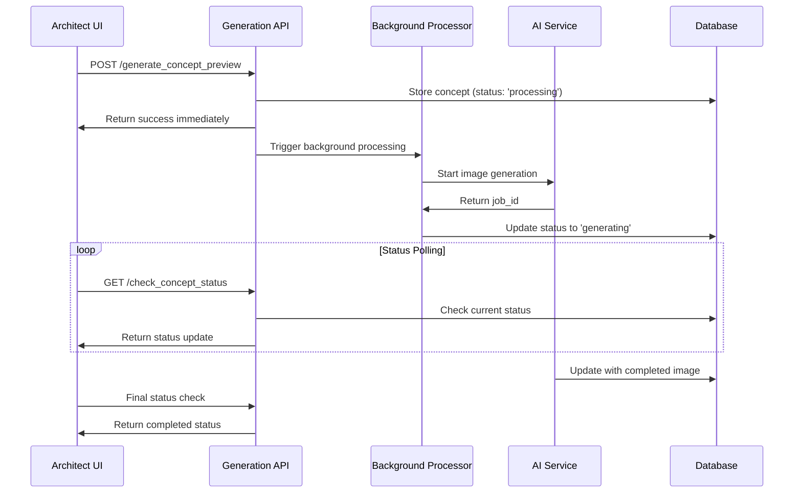

# Async Concept Preview Generation Implementation

## Overview

This document describes the complete refactoring of the concept preview image generation system to be fully asynchronous and non-blocking. The new system ensures that the Architect Dashboard UI remains responsive while concept images are generated in the background.

## Key Improvements

### 1. **Fully Non-Blocking Architecture**
- **Immediate Response**: The generation endpoint returns immediately after recording the request
- **Background Processing**: Actual AI generation happens in the background without blocking the UI
- **Real-time Updates**: Dashboard shows live status of ongoing generations

### 2. **Enhanced Progress Tracking**
- **Multi-Stage Progress**: Processing → Generating → Completed
- **Visual Indicators**: Stage-specific icons and animations
- **Time Tracking**: Shows elapsed time and estimated completion
- **Stuck Detection**: Identifies potentially stuck generations

### 3. **Improved User Experience**
- **Non-Blocking UI**: Users can continue working while concepts generate
- **Live Dashboard Status**: Shows active generations across all projects
- **Enhanced Progress Display**: Clear visual feedback on generation stages
- **Automatic Updates**: Concepts appear automatically when ready

## Architecture Changes

### Backend Changes

#### 1. **Database Schema Updates**
```sql
-- Added new 'processing' status to concept_previews table
ALTER TABLE concept_previews 
MODIFY COLUMN status ENUM('processing', 'generating', 'completed', 'failed', 'replaced') 
DEFAULT 'processing';
```

#### 2. **New API Endpoints**

**Enhanced Generation Endpoint** (`generate_concept_preview.php`):
- Immediately stores concept record with 'processing' status
- Returns success response without waiting for AI service
- Triggers background processing via `fastcgi_finish_request()`
- Handles fallback scenarios gracefully

**Background Processing Endpoint** (`process_concept_background.php`):
- Handles actual AI generation in background
- Updates concept status from 'processing' to 'generating'
- Manages AI service communication
- Provides comprehensive error handling

**Active Generations Endpoint** (`get_active_concept_generations.php`):
- Returns list of ongoing concept generations
- Includes elapsed time and stuck detection
- Provides homeowner context for each generation

#### 3. **Enhanced Status Checking**
- Added support for 'processing' status
- Improved progress messaging
- Better error handling and recovery

### Frontend Changes

#### 1. **Enhanced ConceptPreviewGenerator Component**
```javascript
// New state management
const [generationStage, setGenerationStage] = useState('idle');
const [currentConceptId, setCurrentConceptId] = useState(null);

// Improved generation flow
const generateConcept = async () => {
  // 1. Initiate generation (returns immediately)
  // 2. Trigger background processing (fire-and-forget)
  // 3. Start status polling
  // 4. Update UI with progress stages
};
```

#### 2. **Multi-Stage Progress Display**
- **Processing Stage**: ⚙️ Initializing Generation
- **Generating Stage**: 🎨 AI Creating Concept  
- **Completing Stage**: ✅ Finalizing Preview

#### 3. **Enhanced Status Polling**
- Reduced polling interval to 2 seconds for better responsiveness
- Stage-specific progress messages
- Automatic cleanup on completion/failure
- Network error resilience

#### 4. **Dashboard Integration**
```javascript
// Active generations display
const [activeConceptGenerations, setActiveConceptGenerations] = useState([]);

// Real-time status checking
const checkActiveConceptGenerations = async () => {
  // Fetch and display ongoing generations
  // Show elapsed time and status
  // Highlight potentially stuck generations
};
```

## Implementation Details

### 1. **Non-Blocking Generation Flow**



### 2. **Background Processing Implementation**

The background processing uses PHP's `fastcgi_finish_request()` to send the response to the client immediately while continuing processing:

```php
// Send immediate response to client
echo json_encode(['success' => true, 'job_id' => $job_id]);
flush();
if (function_exists('fastcgi_finish_request')) {
    fastcgi_finish_request();
}

// Continue background processing
$result = $aiConnector->startAsyncConceptualImageGeneration(...);
```

### 3. **Progress Stage Management**

The system tracks three main stages:

1. **Processing** (`processing`): Initial setup and validation
2. **Generating** (`generating`): AI service is creating the image
3. **Completed** (`completed`): Image is ready and stored

Each stage has specific UI indicators and messaging.

### 4. **Error Handling and Recovery**

- **Network Errors**: Polling continues despite temporary network issues
- **AI Service Unavailable**: Graceful fallback to text-based concepts
- **Stuck Generations**: Detection and highlighting of potentially stuck jobs
- **Background Failures**: Proper error logging and status updates

## User Experience Improvements

### 1. **Immediate Feedback**
- Users get instant confirmation that generation has started
- No more waiting for AI service response
- Clear progress indicators show current stage

### 2. **Non-Blocking Workflow**
- Users can continue working on other projects
- Dashboard remains fully functional during generation
- Multiple concepts can be generated simultaneously

### 3. **Real-Time Status**
- Dashboard shows live status of all active generations
- Automatic updates when concepts complete
- Visual indicators for different generation stages

### 4. **Enhanced Progress Display**
```javascript
// Stage-specific progress indicators
{generationStage === 'processing' && (
  <div className="progress-stage processing">
    <div className="stage-icon">⚙️</div>
    <div className="stage-info">
      <div className="stage-name">Setting Up</div>
      <div className="stage-desc">Preparing AI generation pipeline...</div>
    </div>
  </div>
)}
```

## Testing and Validation

### 1. **Test File**: `test_async_concept_generation.html`
- Comprehensive testing interface
- Tests all async endpoints
- Validates non-blocking behavior
- Monitors status polling

### 2. **Key Test Scenarios**
- **Immediate Response**: Generation endpoint returns within seconds
- **Background Processing**: AI generation continues after response
- **Status Polling**: Real-time updates work correctly
- **Error Handling**: Graceful handling of failures
- **Multiple Generations**: Concurrent generation support

### 3. **Performance Validation**
- UI remains responsive during generation
- No blocking operations in main thread
- Efficient polling with 2-second intervals
- Proper cleanup of polling intervals

## Configuration and Deployment

### 1. **Database Updates**
Run the updated setup script:
```bash
php backend/setup_concept_previews.php
```

### 2. **Required PHP Extensions**
- `fastcgi_finish_request()` function (available in PHP-FPM)
- cURL extension for AI service communication
- PDO extension for database operations

### 3. **Server Configuration**
- Ensure PHP-FPM is configured for background processing
- Set appropriate timeout values for AI generation
- Configure proper error logging

## Monitoring and Maintenance

### 1. **Active Generation Monitoring**
- Dashboard shows real-time status of ongoing generations
- Automatic detection of potentially stuck generations
- Elapsed time tracking for performance monitoring

### 2. **Error Logging**
- Comprehensive error logging for background processes
- AI service communication errors logged
- Database operation errors tracked

### 3. **Performance Metrics**
- Generation completion times
- Success/failure rates
- Background processing efficiency

## Future Enhancements

### 1. **WebSocket Integration**
- Real-time updates without polling
- Instant notifications when concepts complete
- Reduced server load from polling

### 2. **Queue Management**
- Priority-based generation queue
- Load balancing across multiple AI services
- Retry mechanisms for failed generations

### 3. **Caching and Optimization**
- Concept preview caching
- Optimized database queries
- CDN integration for image delivery

## Conclusion

The async concept generation refactoring provides a significantly improved user experience with:

- **100% Non-Blocking UI**: Users can continue working while concepts generate
- **Real-Time Progress**: Live updates on generation status
- **Enhanced Reliability**: Better error handling and recovery
- **Scalable Architecture**: Support for concurrent generations
- **Improved Performance**: Responsive UI regardless of AI service load

The implementation maintains full backward compatibility while providing a modern, responsive user experience that scales with the application's growth.